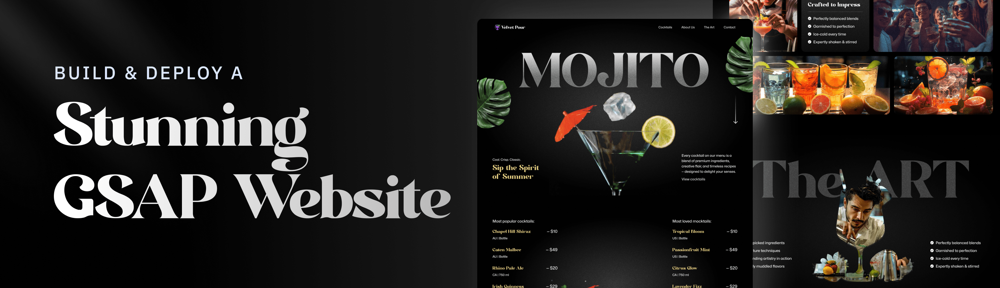

# 🍹 Mojito Cocktails - Velvet Pour

**Live Demo:** [mojito-cocktails-zeta.vercel.app](https://mojito-cocktails-zeta.vercel.app/)

An immersive, animated cocktail bar website showcasing premium mojito experiences through cutting-edge web technologies. This project demonstrates advanced scroll animations, interactive UI elements, and responsive design principles.



---

## ✨ Key Features

### 🎬 **Advanced GSAP Animations**

- **SplitText Effects** - Smooth character and word animations
- **ScrollTrigger Integration** - Scroll-based parallax and reveal animations
- **Pinned Video Playback** - Interactive video scrubbing on scroll
- **Timeline Orchestration** - Complex multi-element animation sequences

### 🎨 **Visual Excellence**

- **Custom Typography** - Modern Negra and DM Serif Text font combinations
- **Masked Image Effects** - Dynamic image reveals with scroll interactions
- **Noise Textures** - Artistic overlay effects for enhanced visual depth
- **Gradient Overlays** - Beautiful color transitions and backgrounds

### 📱 **Responsive Design**

- **Mobile-First Approach** - Optimized for all device sizes
- **Dynamic Breakpoints** - Conditional rendering based on screen size
- **Touch-Friendly** - Smooth interactions on mobile devices
- **Performance Optimized** - Efficient asset loading and rendering

### 🍸 **Interactive Components**

- **Cocktail Carousel** - Smooth sliding menu with tab navigation
- **Dynamic Menu System** - Real-time cocktail information display
- **Parallax Elements** - Floating leaves and decorative elements
- **Smooth Scrolling** - Enhanced navigation experience

---

## 🛠️ Tech Stack

| Technology                                                         | Version | Purpose              |
| ------------------------------------------------------------------ | ------- | -------------------- |
| [React](https://reactjs.org/)                                      | 19.1.0  | Frontend framework   |
| [GSAP](https://greensock.com/gsap/)                                | 3.13.0  | Animation library    |
| [TailwindCSS](https://tailwindcss.com/)                            | 4.1.11  | Styling framework    |
| [Vite](https://vitejs.dev/)                                        | 7.0.0   | Build tool           |
| [React Responsive](https://www.npmjs.com/package/react-responsive) | 10.0.1  | Responsive utilities |

---

## 📁 Project Structure

```
mojito-cocktails/
├── public/
│   ├── images/           # All visual assets (cocktails, decorations, icons)
│   ├── videos/           # Hero section video content
│   ├── fonts/            # Custom typography files
│   └── readme/           # Documentation assets
├── src/
│   ├── components/       # React components
│   │   ├── Hero.jsx      # Landing section with video
│   │   ├── Navbar.jsx    # Navigation component
│   │   ├── Cocktails.jsx # Popular drinks listing
│   │   ├── About.jsx     # Brand story section
│   │   ├── Art.jsx       # Craftsmanship showcase
│   │   ├── Menu.jsx      # Interactive cocktail carousel
│   │   └── Contact.jsx   # Footer with store info
│   ├── constants/        # Data and configuration
│   │   └── index.js      # Cocktail data, nav links, store info
│   ├── App.jsx          # Main application component
│   ├── index.css        # Global styles and Tailwind config
│   └── main.jsx         # Application entry point
├── package.json         # Dependencies and scripts
├── vite.config.js       # Build configuration
└── README.md           # Project documentation
```

---

## 🚀 Getting Started

### Prerequisites

```bash
Node.js >= 18.0.0
npm >= 8.0.0 or yarn >= 1.22.0
```

### Installation & Setup

1. **Clone the repository**

```bash
git clone https://github.com/AnkitMishra2006/mojito-cocktails.git
cd mojito-cocktails
```

2. **Install dependencies**

```bash
npm install
# or
yarn install
```

3. **Start development server**

```bash
npm run dev
# or
yarn dev
```

4. **Open your browser**
   Navigate to `http://localhost:5173` to view the application

### Build for Production

```bash
npm run build        # Build the project
npm run preview      # Preview production build
```

---

## 🎯 Component Breakdown

### **Hero Section**

- Animated title with character-by-character reveal
- Scroll-triggered video playback
- Parallax floating elements
- Responsive typography scaling

### **Cocktails Listing**

- Popular and loved cocktail categories
- Animated entry effects
- Responsive grid layout
- Hover interactions

### **About Section**

- Grid-based image layout
- Staggered animation reveals
- Customer rating display
- Brand storytelling

### **Art Showcase**

- Pinned scroll section
- Masked image effects
- Feature list animations
- Dynamic content reveals

### **Interactive Menu**

- Tab-based navigation
- Smooth carousel transitions
- Real-time content updates
- Arrow navigation controls

### **Contact Footer**

- Store information display
- Opening hours
- Social media links
- Animated section reveals

---

## 🎨 Design Features

### **Color Palette**

- **Primary**: Black (#000000) - Sophisticated base
- **Accent**: Yellow (#e7d393) - Premium highlight
- **Secondary**: White variants (#ffffff, #efefef) - Clean contrast

### **Typography**

- **Headlines**: Modern Negra (Custom) - Bold, impactful
- **Body**: Mona Sans (Google Fonts) - Clean, readable
- **Decorative**: DM Serif Text - Elegant accents

### **Animation Patterns**

- **Entrance**: Slide-up with stagger effects
- **Scroll**: Parallax and pinned interactions
- **Hover**: Subtle scale and opacity changes
- **Transitions**: Smooth easing with power curves

---

## � Performance Optimizations

- **Lazy Loading** - Images and videos load on demand
- **Code Splitting** - Component-based bundle optimization
- **Asset Optimization** - Compressed images and videos
- **Animation Efficiency** - Hardware-accelerated transforms
- **Mobile Optimization** - Reduced animations for touch devices

---

## 🔧 Configuration

### **Vite Configuration**

```javascript
// vite.config.js
export default defineConfig({
  plugins: [react(), tailwindcss()],
  // Additional optimizations
});
```

### **TailwindCSS Custom Utilities**

```css
@utility flex-center {
  @apply flex justify-center items-center;
}
@utility text-gradient {
  /* Custom gradient text */
}
@utility radial-gradient {
  /* Background gradients */
}
```

---

## 📱 Responsive Breakpoints

| Device  | Width          | Layout Changes                        |
| ------- | -------------- | ------------------------------------- |
| Mobile  | < 768px        | Single column, simplified nav         |
| Tablet  | 768px - 1024px | Two columns, condensed spacing        |
| Desktop | > 1024px       | Full grid layout, enhanced animations |

---

## 🎬 Animation Timeline

1. **Page Load**: Hero title animation (1.8s)
2. **Scroll Start**: Parallax elements activate
3. **Video Section**: Pinned playback (scroll-controlled)
4. **Content Sections**: Staggered reveals on scroll
5. **Menu Interaction**: Carousel transitions (0.5s)

---

## 🧪 Testing & Quality

- **ESLint Integration** - Code quality enforcement
- **React Hooks Rules** - Hook usage validation
- **Performance Monitoring** - Animation frame optimization
- **Cross-browser Testing** - Chrome, Firefox, Safari compatibility

---

## 🚀 Deployment

The project is optimized for deployment on:

- **Vercel** (Recommended) - Zero-config deployment
- **Netlify** - Static site hosting
- **GitHub Pages** - Free hosting option
- **Custom Server** - Traditional web hosting

---

## 🎓 Learning Outcomes

This project demonstrates mastery of:

- **Advanced React Patterns** - Hooks, refs, conditional rendering
- **GSAP Animation Library** - ScrollTrigger, timelines, SplitText
- **Modern CSS Techniques** - Grid, flexbox, custom properties
- **Performance Optimization** - Bundle splitting, lazy loading
- **Responsive Design** - Mobile-first development
- **Build Tools** - Vite configuration and optimization

---

## 🤝 Contributing

1. Fork the repository
2. Create a feature branch (`git checkout -b feature/amazing-feature`)
3. Commit your changes (`git commit -m 'Add amazing feature'`)
4. Push to the branch (`git push origin feature/amazing-feature`)
5. Open a Pull Request

---

## 📄 License

This project is licensed under the MIT License - see the [LICENSE](LICENSE) file for details.

---

## 👨‍💻 Author

**Ankit Mishra**

- GitHub: [@AnkitMishra2006](https://github.com/AnkitMishra2006)

---

## 🙏 Acknowledgments

- **GSAP** for powerful animation capabilities
- **Tailwind CSS** for rapid styling development
- **React Team** for the excellent framework
- **Vite** for lightning-fast development experience
- **Design Inspiration** from premium cocktail bars and restaurants

---

_Made with ❤️ and lots of ☕ by Ankit Mishra_
